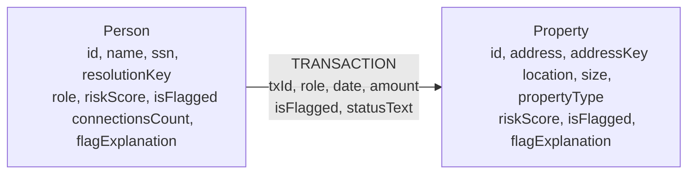
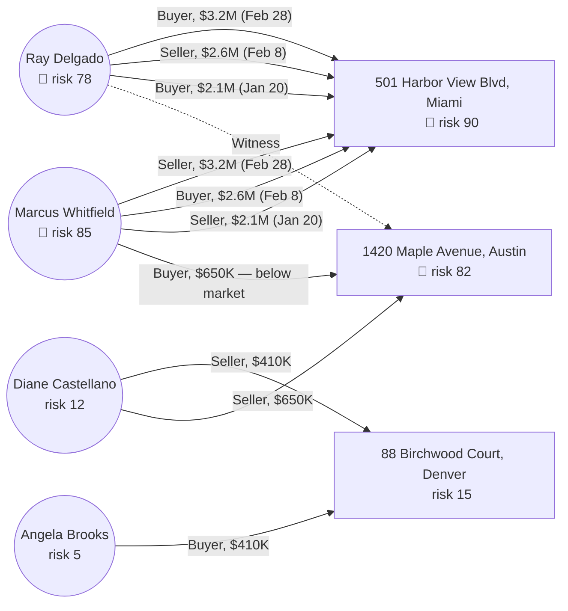
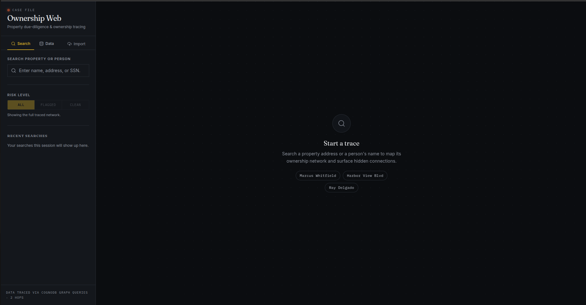
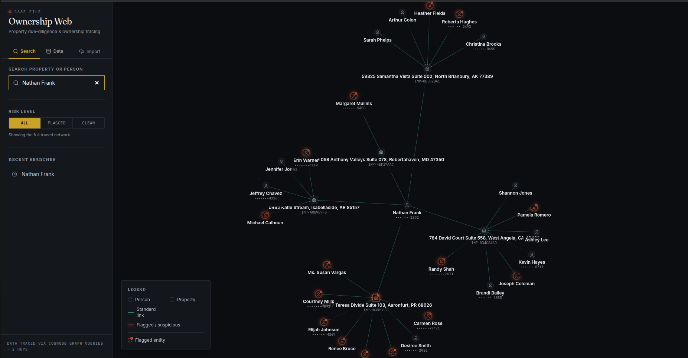
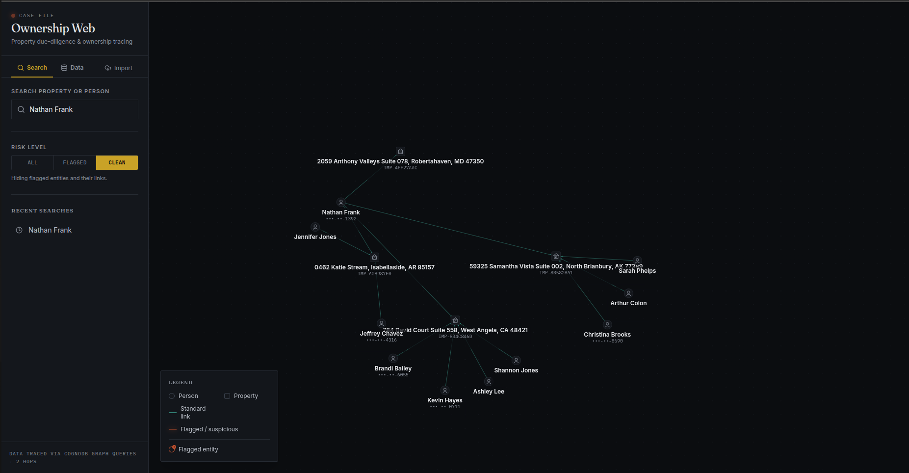
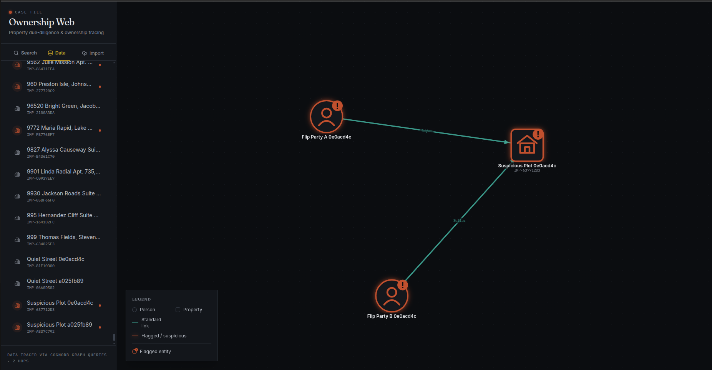
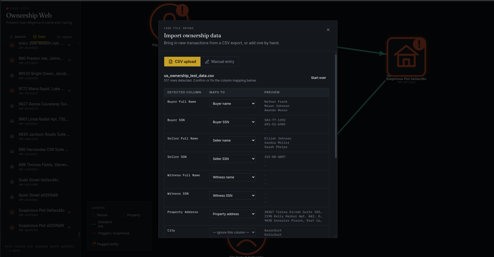
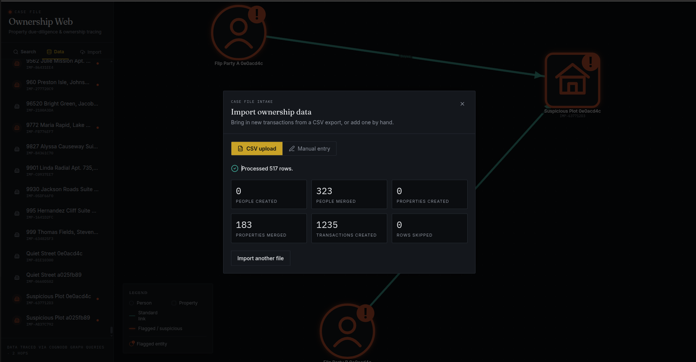
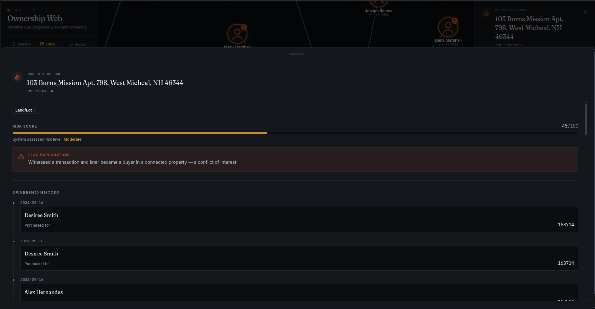
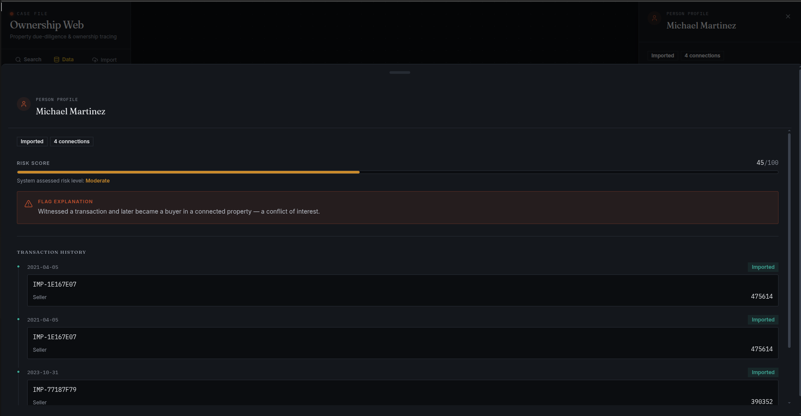

# OwnerTrace

A property due-diligence tool that traces hidden ownership networks and flags suspicious transaction patterns in the US real estate market. The audience is a non-technical buyer or investor who wants to type in a property or seller and visually see who's really connected to it before they buy.

## Why a graph database?

US property fraud often shows up as **multi-party transaction chains** — flip fraud rings reselling the same property among related parties at escalating prices, straw buyers, notaries/witnesses who turn up across an unusual number of unrelated deals — where the suspicion lives not in a single record but in the *pattern* of relationships across multiple entities.

A relational database stores these relationships as join tables. Detecting a "witness-then-buyer" pattern (someone witnesses/notarizes a sale and later buys a connected property) requires multi-table self-joins with temporal filters. Detecting 3-hop circular ownership requires recursive CTEs. Every additional hop multiplies join complexity.

**CognoDB (Neo4j-compatible)** stores ownership networks as a native graph. The same patterns become first-class path queries:

```cypher
-- Find all nodes within 2 hops of a suspicious person
MATCH (p:Person {name: $name})-[*1..2]-(connected)
RETURN connected

-- Detect witness-then-buyer (awkward in SQL; natural in Cypher)
MATCH (p:Person)-[:TRANSACTION {role:'Witness'}]->(prop)
WHERE (p)-[:TRANSACTION {role:'Buyer'}]->(:Property)--(:Person)-->(prop)
RETURN p.name AS suspect, prop.address AS property
```

Variable-length path matching (`*1..2`) and pattern predicates (`WHERE (p)-->...`) are built into Cypher. SQL would need application-level loops or recursive CTEs for the same result.

**Entity resolution makes this argument stronger, not just the fixed demo dataset.** Real
ownership data doesn't arrive as a clean, pre-linked graph — it arrives as rows in a spreadsheet,
the same person spelled slightly differently across different registry exports. Every import here
`MERGE`s new rows onto existing `Person`/`Property` nodes by a resolution key (SSN, or normalized
name/address when no SSN exists) rather than blindly inserting rows. In a relational schema that
merge is a batch `UPDATE`-or-`INSERT` reconciliation job running against a normalized-but-still-
row-shaped table; in a graph it's the same `MERGE` primitive the seed script already uses, and the
moment two rows resolve to one node, every fraud-pattern query above sees the *combined* network
immediately — no separate re-linking step, no risk of the join tables drifting out of sync with
what the graph thinks is connected.

## Data model

Two node labels, one relationship type. Every fact about a deal — who did what, when, for how
much, whether it's flagged — lives on the `TRANSACTION` relationship itself, not split across
join tables.



**`resolutionKey` / `addressKey`** exist for entity resolution — the same person or property can
show up across many transaction rows (seeded or imported via CSV), sometimes with an SSN,
sometimes without, sometimes with slightly different name/address formatting. Every write path
`MERGE`s on these keys instead of `CREATE`ing blindly, so the same real-world entity always
collapses into one node:
- `Person.resolutionKey` = the person's `ssn` if present, otherwise their name normalized
  (lowercased, trimmed, whitespace collapsed). `ssn` and `resolutionKey` are kept as separate
  properties so the UI can still mask/display the real SSN when one exists.
- `Property.addressKey` = the address normalized the same way (lowercased, punctuation stripped,
  whitespace collapsed).
- Both are computed by one shared utility (`backend/src/lib/entityResolution.ts`) used by the seed
  script and the import pipeline, so seeded and imported data are never resolved by two different
  definitions of "the same entity."
- **Known limitation:** exact-normalized-string matching won't catch every real-world duplicate
  address (e.g. "742 Elm St" vs "742 Elm Street" won't merge — no abbreviation expansion is
  attempted). True fuzzy/geocoded matching is out of scope for this project — documented here
  rather than attempted for initial scope.

Here's that schema populated with the actual seed data — the concrete fraud scenario the demo is
built around:



Three fraud signals are visible directly in the shape of the graph:

1. **Circular flip loop** — Marcus and Ray trade the Harbor View Blvd property back and forth 3
   times in 39 days, the price climbing every flip ($2.1M → $2.6M → $3.2M). Neither party is a
   stranger to the other by the third deal.
2. **Witness-then-buyer** — Ray witnesses the Maple Avenue sale, then 8 days later becomes a buyer
   in a deal connected to the same seller network. A witness who later profits from a connected
   deal is a conflict of interest.
3. **Below-market sale** — Maple Avenue sells for $650,000 against a comparable-home baseline of
   $850,000+.

## Project structure

```
/
├── frontend/          React + Vite + Tailwind frontend (force-graph, dossier panel)
│   └── src/lib/mockApi.ts   Reference/fallback mock data — not on the active code path
├── backend/           Express API server with CognoDB/Neo4j integration
│   └── src/__tests__/       Integration tests, run against the real seeded database
├── images/             Screenshots referenced in this README
├── sample_ownership_data.csv   Sample CSV for testing the import flow (see Data import, below)
└── TESTING.md         Manual test checklist
```

## Stack

- **Frontend**: React 19, TypeScript, Vite, Tailwind CSS, react-force-graph-2d, Framer Motion
- **Backend**: Node.js, Express 5, neo4j-driver (compatible with CognoDB)
- **Database**: CognoDB Cloud (openCypher over Bolt — Neo4j-compatible)

## Setup

### 1. Create a CognoDB Cloud instance

1. Sign up at [console.cognodb.com/signup](https://console.cognodb.com/signup) — free tier, no credit card needed
2. Create a free `c0` instance and pick a region
3. Copy the Bolt URI (`bolt+s://<instance-id>.databases.cognodb.cloud`) and the generated
   password for the `cognodb` user — **the password is shown once**, so save it immediately

### 2. Set environment variables

Create `backend/.env` (gitignored — never commit this file):

```env
COGNODB_URI=bolt+s://<instance-id>.databases.cognodb.cloud
COGNODB_USER=cognodb
COGNODB_PASSWORD=<the generated password>
```

The backend loads this automatically via Node's `--env-file-if-exists` flag — no extra tooling
or `dotenv` dependency needed. Nothing crashes if the file is missing; the server just starts in
mock-only mode and every request that needs the database returns a clear error (see `driver.ts`).

### 3. Install dependencies

```bash
pnpm install
```

### 4. Seed the database

```bash
pnpm --filter backend run build
pnpm --filter backend run seed
```

This creates all Person and Property nodes and their TRANSACTION relationships, matching the fraud-pattern demo scenario (the Marcus Whitfield / Harbor View Blvd flip loop).

> **CognoDB quirk worth knowing:** a single `MATCH` clause with multiple comma-separated node
> patterns (`MATCH (a), (b), (c) ...`) causes CognoDB to silently re-execute every downstream
> `CREATE` clause combinatorially — one seed run produced 19,008 `TRANSACTION` relationships
> instead of 11 before this was caught and fixed. Chaining separate `MATCH` clauses instead
> (`MATCH (a) MATCH (b) MATCH (c) ...`) is valid Cypher, behaves identically on real Neo4j, and
> avoids the bug — that's what `seed.ts` does. Worth keeping in mind for any future multi-node
> write query against CognoDB.

### 5. Run the backend

```bash
pnpm --filter backend run dev
# Listening on http://localhost:5000
```

### 6. Run the frontend

Create `frontend/.env` pointing at the backend:

```env
VITE_API_URL=http://localhost:5000
```

```bash
pnpm --filter frontend run dev
# Open http://localhost:5173
```

The frontend always calls the real backend at `VITE_API_URL` — there's no mock-data fallback in
the active code path. `frontend/src/lib/mockApi.ts` still exists in the repo as a reference (it
mirrors the seed data exactly), but nothing imports it by default; wire it in manually if you
want to work on UI without a backend running.

### 7. Run the tests

```bash
pnpm run test          # both packages
pnpm --filter backend run test    # 32 tests against the real seeded database, incl. the import pipeline
pnpm --filter frontend run test   # 9 unit/component tests
```

The import tests write real persistent data (there's no "undo" for a `MERGE`-based import) — run
`pnpm --filter backend run seed` afterward to restore the clean demo scenario. See
[`TESTING.md`](TESTING.md) for the manual click-through checklist.

## Data import

Beyond the seeded demo scenario, the app can ingest new ownership/transaction data two ways —
click the **Import** tab in the sidebar, which opens the import dialog on top of the current graph:

- **CSV upload.** Drop in a flat transactions CSV (one row per deal — buyer, seller, optional
  witness, property, date, amount; no fixed column names required). The app detects your headers,
  suggests a mapping to its known fields, shows a preview, and only commits once you confirm. No
  column-name convention to memorize — `purchaser_name`, `buyer`, and `Buyer Name` all suggest the
  same target field.
- **Manual entry.** A single-transaction form for one-off additions, sharing the exact same
  entity-resolution logic as CSV import under the hood — not a separate code path.

**Sample file included:** [`sample_ownership_data.csv`](sample_ownership_data.csv) at the repo
root is a ready-made sample — several hundred rows of varied header names and realistic buyer/
seller/witness/property data — for exercising the CSV upload path end to end (column-mapping
suggestions, the preview, entity-resolution merging on a re-import, the commit summary). Open the
**Import** tab, choose **CSV upload**, and drop this file in to see it work without having to
hand-write a test CSV first.

Every import `MERGE`s people/properties onto existing nodes by `resolutionKey`/`addressKey`
(see [Data model](#data-model)) instead of blindly creating new ones, so re-importing the same CSV
— or a manual entry referencing someone already in the graph — folds into existing nodes rather
than duplicating them. The commit response reports exactly what happened: rows processed, people/
properties created vs. merged, transactions created, and any rows skipped with a reason (missing
required field, etc.) — a partial failure never leaves the graph silently half-imported without
telling you.

**Known limitation beyond the address-matching one already noted above:** resolution keys aren't
reconciled across key types. If the same person appears with an SSN in one row and without one in
another (or in a different import), they resolve to two different nodes — an SSN-keyed one and a
name-keyed one — since there's no attempt to say "this name-keyed node and that SSN-keyed node
are probably the same person." True identity reconciliation across partial identifiers is a
natural next step, out of scope here for the same reason fuzzy address matching is.

## Key Cypher queries

### Multi-hop ownership traversal (`/api/search`)

```cypher
MATCH (start)
WHERE (start:Person AND toLower(start.name) CONTAINS toLower($query))
   OR (start:Property AND toLower(start.address) CONTAINS toLower($query))
WITH collect(DISTINCT start) AS starts

UNWIND starts AS s
MATCH path = (s)-[*1..2]-(n)

WITH
  starts + [node IN nodes(path) | node] AS allNodes,
  [rel  IN relationships(path) | rel]   AS allRels

UNWIND allNodes AS node
WITH collect(DISTINCT node) AS nodes, collect(allRels) AS relLists
UNWIND relLists AS relList
UNWIND relList AS rel

WITH nodes, collect(DISTINCT rel) AS rels
UNWIND rels AS r
RETURN nodes,
       collect(DISTINCT {
         sourceId:  startNode(r).id,
         targetId:  endNode(r).id,
         isFlagged: r.isFlagged,
         role:      r.role
       }) AS edges
```

`(s)-[*1..2]-(n)` expands from the search result to every node within 2 relationship hops — regardless of direction or relationship type. SQL would require two self-joins on a transaction table. Adding a third hop is changing `2` to `3`.

The `RETURN` resolves each relationship's endpoints via `startNode()`/`endNode()` into the same
application-level `id` used by nodes, rather than returning the raw relationship (whose only
built-in endpoint references are Neo4j's internal element IDs — a different ID space than
`node.id`, and a real bug the first version of this query had: edges pointed at IDs the frontend
graph renderer could never match against a node, so every relationship silently rendered with no
visible edge).

### Entity dossier with transaction history (`/api/entity/:id`)

```cypher
MATCH (n {id: $id})
OPTIONAL MATCH (n)-[r:TRANSACTION]-(prop)
RETURN n, collect(r) AS txRels, collect(prop) AS txProps, labels(n) AS labels
```

Returns the node and all its TRANSACTION relationships in one round-trip. In SQL this is a join across `persons`/`properties` and `transactions` tables — straightforward here, but the moment you need to follow those transactions to their *other* participants (for second-degree risk scoring), you need another join. In graph, that's `(n)-[:TRANSACTION]-(prop)-[:TRANSACTION]-(other)` — one extended pattern.

### Fraud-pattern detection (`/api/patterns`) — the SQL-awkward query

This is the query that's genuinely hard to express in SQL, not just verbose. It server-side
detects two fraud signatures rather than leaving a human to eyeball flagged colors on the graph.

**Circular flip loop** — two people selling the same property back and forth within a day window:

```cypher
MATCH (a:Person)-[sell1:TRANSACTION {role: 'Seller'}]->(prop:Property)<-[buy1:TRANSACTION {role: 'Buyer'}]-(b:Person)
WHERE buy1.date = sell1.date
MATCH (b)-[sell2:TRANSACTION {role: 'Seller'}]->(prop)<-[buy2:TRANSACTION {role: 'Buyer'}]-(a)
WHERE buy2.date = sell2.date
  AND sell2.date > sell1.date
  AND duration.between(date(sell1.date), date(sell2.date)).days <= $maxDays
RETURN DISTINCT a.id, b.id, prop.id, sell1.date, sell2.date, sell1.amount, sell2.amount
```

(An earlier version added an `a.id < b.id` filter meant to collapse a longer flip *chain* into one
row. It only looked correct because the seed data's fixed IDs happened to align with who sold
first — it silently dropped real detections once entities got randomly generated IDs from the
data import pipeline. Removed; every temporally-distinct flip-back pair in a chain is now its
own row.)

**Witness-then-buyer** — someone witnesses a deal, then buys into a *different* property that's
connected to that deal through a shared participant:

```cypher
MATCH (witness:Person)-[:TRANSACTION {role: 'Witness'}]->(witnessedProp:Property)
MATCH (witness)-[:TRANSACTION {role: 'Buyer'}]->(otherProp:Property)
WHERE otherProp.id <> witnessedProp.id
MATCH (witnessedProp)<-[:TRANSACTION]-(participant:Person)-[:TRANSACTION]-(otherProp)
WHERE participant.id <> witness.id
RETURN DISTINCT witness.id, witnessedProp.id, otherProp.id, participant.id
```

In SQL, each of these needs several self-joins on the same `transactions` table with role/date
join conditions, and the witness-then-buyer query additionally needs a join just to discover
*which* properties are even related before it can check who bought into them. In Cypher both read
as a shape: "seller → property ← buyer, then buyer → property ← seller again" and "witness →
property ← someone, and that someone also touches a second property the witness later bought."

Against the seeded data, witness-then-buyer returns exactly one hit: Ray witnessing the Maple
Avenue sale then buying into Harbor View Blvd, which Marcus (a participant in the witnessed deal)
is also part of. Circular flip returns two — the seeded 3-deal chain (Marcus→Ray→Marcus→Ray)
contains two distinct, non-overlapping flip-back pairs (deal1→deal2 and deal2→deal3), and both are
genuine signal worth surfacing, not duplicates of each other.

### Live risk score (`riskScore`/`isFlagged`/`flagExplanation` on every entity)

`riskScore` is not a stored column — it's computed at request time in `lib/riskScoring.ts` from
four graph-structure signals, each a real count, combined into a weighted 0–100 score (flagged at
≥ 40): flagged-transaction involvement, circular-flip involvement (reusing the query above),
witness-then-buyer involvement (reusing the query above), and shared-witness exposure (is this
entity's transaction witnessed by someone who *also* witnesses other flagged deals elsewhere —
the "shared witnesses across unrelated deals" pattern from network analysis specifications). The seeded
`riskScore`/`isFlagged`/`flagExplanation` properties still exist on each node as fallback
reference values (same as `mockApi.ts`), but neither `/api/search` nor `/api/entity/:id` ever
reads them — every response is live. This is what makes CSV/manual import (Data import, above)
work without any separate scoring step: a newly imported transaction that completes a circular-
flip loop or a witness-then-buyer pattern changes the involved entities' scores on the very next
read, because the score was never "set" anywhere to begin with.

## Screenshots

**Landing page** — the empty state on load, with the sidebar's `Search` / `Data` / `Import` tabs
and a few example searches to get started.



**Search results** — a 2-hop traced network around a search hit, showing person and property
nodes, flagged entities glowing, and the risk-level legend.



**Risk level filter** — the same search with the `Clean` filter applied, hiding every flagged
entity and its links so only the unflagged part of the network remains visible.



**Data tab** — the case file directory: every person and property on file in one scrollable,
alphabetically-sorted list, flagged entities marked, click-through into that entity's graph.



**CSV import with column mapping** — a real 517-row CSV dropped in, with headers auto-mapped to
the right target fields (buyer/seller/witness name + SSN, property address, date, amount) for
confirmation before committing.



**Import result summary** — the same import committed: rows processed, people/properties created
vs. merged via entity resolution, and transactions created, with the newly-imported flagged
network visible in the background.



**Live risk score — property side** — the dossier for an imported property (`Land/Lot`, risk
45/100, `Moderate`) showing the same witness-then-buyer flag explanation and its ownership
history, computed live from graph structure rather than read off a stored value.



**Live risk score — person side** — the same witness-then-buyer conflict from the other end of the
relationship: the person's dossier (Michael Martinez, risk 45/100, `Moderate`) with matching flag
explanation and transaction history, confirming the score is consistent across both entities in
the flagged pattern.



## API reference

| Method | Path | Description |
|--------|------|-------------|
| `GET` | `/api/healthz` | Health check |
| `GET` | `/api/search?q=<query>` | Find matching entities + 2-hop subgraph |
| `GET` | `/api/entity/:id` | Full dossier for one Person or Property |
| `GET` | `/api/patterns?maxDays=<n>` | Server-side fraud-pattern detection (circular flips, witness-then-buyer). `maxDays` defaults to 60. |
| `POST` | `/api/import/preview` | `{ csvContent }` → detected headers, suggested column mapping, a sample-row preview |
| `POST` | `/api/import/commit` | `{ csvContent, mapping }` → parses every row, `MERGE`s into the graph, returns an import summary |
| `POST` | `/api/import/manual` | A single transaction row → same import pipeline as `commit`, one row |

All endpoints return JSON. Errors return `{ "error": "<plain-language message>" }`.
